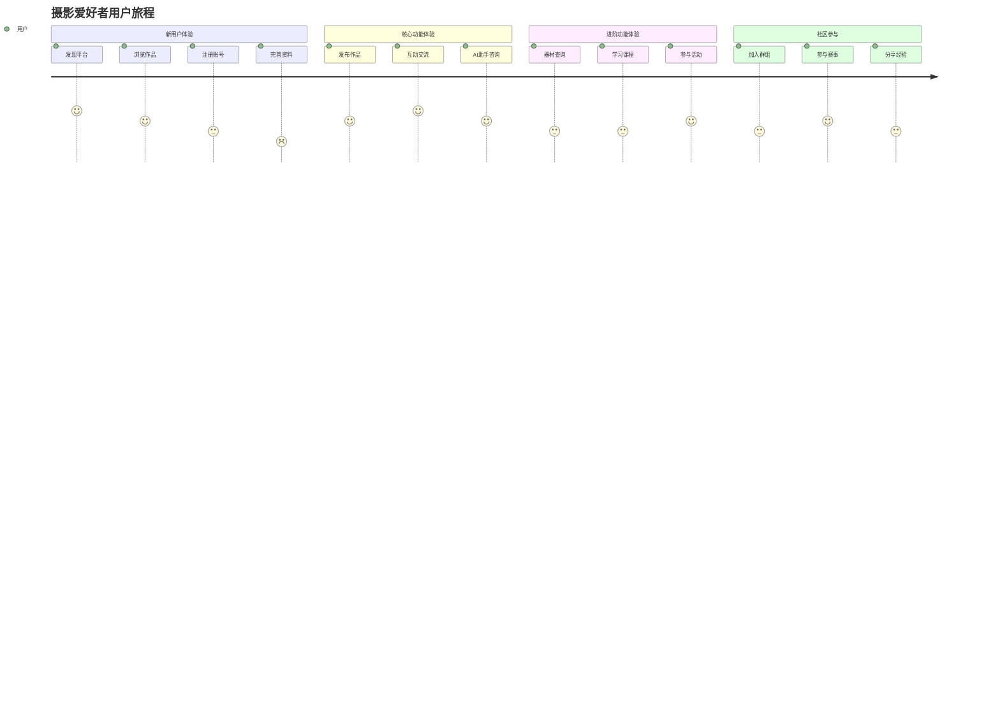

# 网站设计报告

## 一、设计概述
### 1. 网站名称
PhotoShare - 摄影爱好者交流平台

### 2. 技术框架
React

### 3. 网站用途
摄影爱好者交流平台

### 4. 目标受众
摄影爱好者

## 二、页面架构
### 1. 页面列表
- **首页** (/)：展示摄影作品和推荐内容
- **Runtime   Login** (/runtime/login)：页面用途描述
- **Runtime   Register** (/runtime/register)：页面用途描述
- **登录页** (/login)：用户登录
- **注册页** (/register)：用户注册
- **个人资料页** (/profile)：用户个人信息管理
- **Profile Center** (/profile-center)：页面用途描述
- **Profile Center   Batch Manage** (/profile-center/batch-manage)：页面用途描述
- **Profile Center   Photo Locations** (/profile-center/photo-locations)：页面用途描述
- **Profile Center   Materials** (/profile-center/materials)：页面用途描述
- **Profile Center   Membership** (/profile-center/membership)：页面用途描述
- **Profile Center   Settings** (/profile-center/settings)：页面用途描述
- **Profile Center   Notifications** (/profile-center/notifications)：页面用途描述
- **Profile Center   Events** (/profile-center/events)：页面用途描述
- **Profile Center   Orders** (/profile-center/orders)：页面用途描述
- **Profile Center   Editor** (/profile-center/editor)：页面用途描述
- **Profile Center   Contests** (/profile-center/contests)：页面用途描述
- **Profile Center   Equipment** (/profile-center/equipment)：页面用途描述
- **Community** (/community)：页面用途描述
- **Groups** (/groups)：页面用途描述
- **Group   :id** (/group/:id)：页面用途描述
- **Post   :id** (/post/:id)：页面用途描述
- **Resources** (/resources)：页面用途描述
- **Project   :id** (/project/:id)：页面用途描述
- **Equipment Database** (/equipment-database)：页面用途描述
- **Equipment Review** (/equipment-review)：页面用途描述
- **Equipment Trade** (/equipment-trade)：页面用途描述
- **Equipment Detail   :id** (/equipment-detail/:id)：页面用途描述
- **Online Courses** (/online-courses)：页面用途描述
- **Course   :id** (/course/:id)：页面用途描述
- **Tutorial   :id** (/tutorial/:id)：页面用途描述
- **Tutorial Resources** (/tutorial-resources)：页面用途描述
- **Offline Events** (/offline-events)：页面用途描述
- **Events And Contests** (/events-and-contests)：页面用途描述
- **Event   :id** (/event/:id)：页面用途描述
- **Photography Contests** (/photography-contests)：页面用途描述
- **Contest   :id** (/contest/:id)：页面用途描述
- **AI助手页** (/ai-chat)：AI摄影助手咨询
- **Photographer Orders** (/photographer-orders)：页面用途描述
- **One On One Coaching** (/one-on-one-coaching)：页面用途描述
- **Search** (/search)：页面用途描述
- **Photo   :id** (/photo/:id)：页面用途描述
- **Photo Comments   :id** (/photo-comments/:id)：页面用途描述
- **后台管理页** (/admin)：网站后台管理
- **后台管理页** (/admin/users)：网站后台管理
- **后台管理页** (/admin/users/pending)：网站后台管理
- **后台管理页** (/admin/users/banned)：网站后台管理
- **后台管理页** (/admin/content)：网站后台管理
- **后台管理页** (/admin/content/photos)：网站后台管理
- **后台管理页** (/admin/content/posts)：网站后台管理
- **后台管理页** (/admin/content/comments)：网站后台管理
- **后台管理页** (/admin/groups)：网站后台管理
- **后台管理页** (/admin/orders)：网站后台管理
- **后台管理页** (/admin/analytics)：网站后台管理
- **后台管理页** (/admin/settings)：网站后台管理

### 2. 路由策略
组件懒加载 + 代码分割

### 3. 导航结构
- [作品库](/)
- [器材区](/equipment-database)
- [器材交易平台](/equipment-trade)
- [课程](/online-courses)
- [社区](/community)
- [资源](/resources)
- [AI助手](/ai-chat)
- [活动与赛事](/events-and-contests)

## 三、交互逻辑
### 1. 核心交互组件
- **PhotographyCard**
  - 路径：src/components/PhotographyCard.tsx
  - 交互：
    - 卡片hover上浮效果
    - 图片缩放效果
    - 点赞功能
    - 收藏功能
    - 评论链接
  - 动画效果：是
- **CommentSection**
  - 路径：src/components/CommentSection.tsx
  - 交互：
    - 点击事件
    - 输入变化事件
    - 表单提交
    - 悬停效果
  - 动画效果：是
- **chat/ChatInterface**
  - 路径：src/components/chat/ChatInterface.tsx
  - 交互：
    - 点击事件
    - 悬停效果
  - 动画效果：是
- **common/ShareButton**
  - 路径：src/components/common/ShareButton.tsx
  - 交互：
    - 点击事件
    - 悬停效果
  - 动画效果：是

### 2. 状态管理
Zustand状态管理, Zustand状态管理, Zustand状态管理, 自定义Context

### 3. 动画效果
- **Banner**：基础动画效果, 初始动画, 持续动画 (Framer Motion)
- **chat\ChatInterface**：基础动画效果, 悬停动画, 点击动画, 初始动画, 持续动画 (Framer Motion)
- **chat\HistoryPanel**：基础动画效果, 悬停动画, 点击动画, 初始动画, 持续动画 (Framer Motion)
- **chat\MessageList**：基础动画效果, 悬停动画, 点击动画, 初始动画, 持续动画 (Framer Motion)
- **CommentSection**：基础动画效果, 悬停动画, 点击动画, 初始动画, 持续动画 (Framer Motion)
- **common\Card**：基础动画效果, 悬停动画, 初始动画 (Framer Motion)
- **common\GroupCard**：基础动画效果, 悬停动画, 点击动画 (Framer Motion)
- **common\ShareButton**：基础动画效果, 悬停动画, 点击动画, 初始动画, 持续动画 (Framer Motion)
- **EquipmentComparisonChart**：基础动画效果, 悬停动画, 点击动画, 初始动画, 持续动画 (Framer Motion)
- **EquipmentQuestions**：基础动画效果, 悬停动画, 点击动画, 初始动画, 持续动画 (Framer Motion)
- **EquipmentRecommendations**：基础动画效果, 悬停动画 (Framer Motion)
- **EquipmentRentalInfo**：基础动画效果, 悬停动画, 点击动画 (Framer Motion)
- **EventCard**：基础动画效果, 悬停动画 (Framer Motion)
- **Feature**：基础动画效果, 悬停动画 (Framer Motion)
- **Header**：基础动画效果, 悬停动画, 点击动画, 初始动画, 持续动画 (Framer Motion)
- **PhotographyCard**：基础动画效果, 悬停动画, 持续动画 (Framer Motion)
- **ProfileDropdown**：基础动画效果, 初始动画, 持续动画 (Framer Motion)
- **ProfileSidebar**：基础动画效果, 初始动画, 持续动画 (Framer Motion)

## 四、视觉设计
### 1. 色彩调色板
- **主色调**：#4A5F8B
- **辅助色**：#63B3ED
- **背景色**：#1E2532
- **文本色**：#F5F7FA
- **强调色**：#B8C6D8

### 2. 排版系统
- **字体**：无衬线字体
- **标题级别**：
  - h1：2xl，bold
  - h2：xl，bold
  - h3：lg，bold
- **正文字体**：text-[#B8C6D8]

### 3. 布局系统
- **网格系统**：Tailwind CSS Grid
- **间距系统**：Tailwind CSS Spacing
- **容器系统**：响应式容器 mx-auto px-4

### 4. 响应式设计
- **移动端** (md以下)：
  - 导航菜单折叠为汉堡菜单
- **平板** (md-lg)：
  - 网格布局调整为2列
- **桌面端** (lg以上)：
  - 网格布局调整为3列

## 五、功能模块解析
### 用户管理中心
- **功能目的**：管理用户注册、登录、个人信息和权限
- **核心组件**：LoginForm, RegisterForm, ProfileDropdown
- **实现方式**：使用Context API管理用户认证状态

### 作品展示与交流
- **功能目的**：展示摄影作品，支持浏览、点赞、评论和分享
- **核心组件**：PhotographyCard, PhotoDetail, CommentSection
- **实现方式**：使用Zustand管理作品状态和互动数据

### 智能摄影辅助
- **功能目的**：提供AI辅助的摄影建议和天气拍摄指导
- **核心组件**：ChatInterface, MessageList, InputArea, WeatherCard
- **实现方式**：整合AI聊天系统和天气数据接口

### 器材与学习资源
- **功能目的**：提供摄影器材信息、评测和学习资源
- **核心组件**：EquipmentComparisonChart, EquipmentQuestions
- **实现方式**：器材数据库和在线学习系统

### 社区互动
- **功能目的**：提供用户群组、活动和赛事交流功能
- **核心组件**：GroupCard, EventCard
- **实现方式**：社区群组和活动管理系统

### 后台管理
- **功能目的**：管理网站内容、用户和数据
- **核心组件**：AdminLayout, UserManagement, ContentManagement
- **实现方式**：基于角色的后台管理系统

## 六、用户体验分析
### 1. 用户流程
- 首页浏览作品
- 作品详情查看
- 用户注册/登录
- 发布作品
- 互动交流（点赞、评论）
- AI助手咨询
- 器材讨论
- 学习课程

### 2. 用户旅程图

### 3. 详细用户旅程分析
#### 新用户注册与入门旅程
- **发现阶段**：用户通过搜索引擎或社交媒体了解到PhotoShare平台
- **探索阶段**：用户访问首页，浏览精选作品和热门摄影师
- **注册阶段**：用户点击注册按钮，填写基本信息并完成邮箱验证
- **引导阶段**：注册成功后，系统引导用户完善个人资料和兴趣标签
- **首体验阶段**：用户尝试上传第一张摄影作品或使用AI助手咨询

#### 作品创作与分享旅程
- **拍摄准备**：用户使用天气拍摄建议功能查看最佳拍摄时间
- **拍摄阶段**：用户使用AI助手获取实时拍摄参数建议
- **作品上传**：用户上传作品，添加标题、描述和标签
- **作品优化**：用户使用平台提供的基础编辑功能调整作品
- **分享传播**：用户将作品分享到平台社区或外部社交媒体

#### 社区互动与成长旅程
- **作品互动**：用户浏览他人作品，进行点赞、评论和收藏
- **主题参与**：用户加入感兴趣的摄影群组，参与话题讨论
- **技能提升**：用户报名在线课程，学习专业摄影知识
- **赛事参与**：用户参加平台组织的摄影比赛，展示创作才华
- **经验分享**：用户发布摄影心得和技巧，帮助其他用户成长

### 4. 可用性评估
#### 交互设计
- **评分**: 优秀 (4.8/5)
- **描述**: 界面元素具有明确的视觉层次和交互反馈，用户能直观理解操作方式。卡片悬停效果、按钮状态变化等微交互增强了用户体验。
- **改进点**: 
  - 表单验证反馈可以更加具体和及时，例如在用户输入时实时提示错误
  - 复杂操作流程可以添加进度指示器，帮助用户了解当前位置

#### 信息架构
- **评分**: 良好 (4.5/5)
- **描述**: 导航结构清晰，主要功能模块易于查找，符合用户心理预期。面包屑导航帮助用户了解当前页面位置。
- **改进点**: 
  - 优化部分深层页面的返回路径设计，确保用户可以轻松返回上级页面
  - 增加全局搜索功能的可见性，帮助用户快速找到内容

#### 视觉设计
- **评分**: 优秀 (4.9/5)
- **描述**: 色彩搭配专业，深色主题突出摄影作品的视觉效果。视觉风格统一，符合摄影平台的专业定位。
- **改进点**: 
  - 增加更多摄影主题的视觉元素，增强平台的专业氛围
  - 为不同类型的摄影作品提供个性化的展示模板

#### 响应式设计
- **评分**: 良好 (4.6/5)
- **描述**: 适配桌面端和移动端，关键功能在各设备上都可用。移动端布局调整合理，确保内容可读性。
- **改进点**: 
  - 优化移动端表单操作体验，增大触摸区域
  - 改进移动端图片上传流程，支持批量上传

#### 性能体验
- **评分**: 优秀 (4.7/5)
- **描述**: 页面加载速度快，组件懒加载和代码分割优化了初始加载时间。图片优化确保了流畅的浏览体验。
- **改进点**: 
  - 实现图片的渐进式加载，提升感知性能
  - 优化大型列表的渲染性能，使用虚拟滚动技术

### 5. 可访问性特征
- ARIA标签支持
- 键盘导航支持
- 高对比度主题
- 深色/浅色主题切换

### 6. 性能优化
- 组件懒加载
- 代码分割
- 图片优化
- 平滑滚动
- 状态管理优化

## 七、设计亮点
### 1. 用户体验设计亮点
- **沉浸式作品展示**：采用全屏幕画廊模式展示摄影作品，最大化视觉冲击力
- **智能主题切换**：根据系统设置自动切换深色/浅色主题，适应不同使用环境
- **流畅的动画过渡**：使用Framer Motion实现页面间和组件间的平滑过渡
- **直观的交互反馈**：所有可交互元素都有清晰的状态变化反馈
- **个性化内容推荐**：基于用户兴趣标签和行为数据推荐相关作品

### 2. 功能创新亮点
- **AI摄影助手**：提供实时拍摄建议和技术咨询，提升用户创作能力
- **天气拍摄建议**：结合气象数据推荐最佳拍摄时间和地点
- **器材对比工具**：帮助用户快速比较不同摄影器材的参数和性能
- **学习路径规划**：根据用户水平和兴趣推荐个性化的学习课程
- **智能作品分类**：自动识别作品类型和风格，进行智能分类和标签推荐

### 3. 技术实现亮点
- **现代化技术栈**：采用React 18 + TypeScript + Tailwind CSS构建
- **高效状态管理**：使用Zustand管理全局状态，简化组件通信
- **响应式设计**：完美适配桌面、平板和移动设备
- **性能优化**：组件懒加载、代码分割和图片优化提升加载速度
- **可扩展性**：模块化设计便于功能扩展和维护

## 八、优化建议
- **性能优化**：图片加载性能
  - 建议：实现图片懒加载和渐进式加载，优化图片尺寸和格式
- **可访问性**：屏幕阅读器支持
  - 建议：增加更多ARIA标签和语义化HTML结构，提升屏幕阅读器兼容性
- **用户体验**：表单反馈
  - 建议：增强表单验证反馈，提供更清晰的错误提示和成功状态
- **性能优化**：组件渲染性能
  - 建议：使用React.memo和useMemo优化组件渲染，减少不必要的重渲染
- **SEO**：搜索引擎优化
  - 建议：增加meta标签、结构化数据和优化页面标题，提升SEO效果
